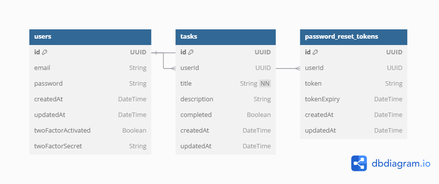

# Task Management System

## Overview

This project is a task management system built with Next.js, Drizzle ORM, and PostgreSQL. It provides a RESTful API for creating, reading, updating, and deleting tasks, as well as user authentication and task management features.

- **Deployment URL**: [final-project-rust-iota.vercel.app](https://final-project-rust-iota.vercel.app/)

## Features

- User registration and authentication
- Create, read, update, and delete tasks
- Retrieve tasks by user ID
- Caching with Redis (currently commented out for demonstration)
- Docker support for containerization
- Nginx for load balancing

## Technologies Used

- Next.js 14
- Drizzle ORM
- PostgreSQL
- Redis
- Docker
- Nginx
- NextAuth for authentication


## Database Schema

This document outlines the database schema used in the application, detailing the tables and their respective fields.

### Database Diagram



### Users Table

The `users` table stores user information. The schema is defined as follows:

| Field                | Type     | Description                                           |
|----------------------|----------|-------------------------------------------------------|
| `id`                 | UUID     | Primary key, automatically generated.                  |
| `email`              | VARCHAR  | Unique email address of the user.                     |
| `password`           | VARCHAR  | Hashed password for user authentication.               |
| `createdAt`          | TIMESTAMP| Timestamp when the user account was created.          |
| `updatedAt`          | TIMESTAMP| Timestamp when the user account was last updated.     |
| `twoFactorActivated`  | BOOLEAN  | Indicates if two-factor authentication is enabled.    |
| `twoFactorSecret`    | VARCHAR  | Secret used for two-factor authentication.             |

### Password Reset Tokens Table

The `password_reset_tokens` table stores tokens used for password reset requests. The schema is defined as follows:

| Field                | Type     | Description                                           |
|----------------------|----------|-------------------------------------------------------|
| `id`                 | UUID     | Primary key, automatically generated.                  |
| `userId`             | UUID     | Foreign key referencing the `users` table.            |
| `token`              | VARCHAR  | Token used for password reset.                         |
| `tokenExpiry`        | TIMESTAMP| Expiration time of the token.                          |
| `createdAt`          | TIMESTAMP| Timestamp when the token was created.                 |
| `updatedAt`          | TIMESTAMP| Timestamp when the token was last updated.            |

### Tasks Table

The `tasks` table stores tasks associated with users. The schema is defined as follows:

| Field                | Type     | Description                                           |
|----------------------|----------|-------------------------------------------------------|
| `id`                 | UUID     | Primary key, automatically generated.                  |
| `userId`             | UUID     | Foreign key referencing the `users` table.            |
| `title`              | VARCHAR  | Title of the task, cannot be null.                    |
| `description`        | VARCHAR  | Description of the task.                               |
| `completed`          | BOOLEAN  | Indicates if the task has been completed.             |
| `createdAt`          | TIMESTAMP| Timestamp when the task was created.                  |
| `updatedAt`          | TIMESTAMP| Timestamp when the task was last updated.             |


## API Documentation

### Overview

This API allows users to manage tasks with functionalities for creating, retrieving, updating, and deleting tasks. 

### Base URL
The base URL for the API is:  
[https://final-project-rust-iota.vercel.app/api](https://final-project-rust-iota.vercel.app/api)

### Authentication

You need to register a user and in order to get the userId.

### Endpoints

### 1. User Registration

- **POST** `/api/register`
  
### Request Body
```json
{
  "email": "string",
  "password": "string"
}

### 2. Create Task

- **POST** `/api/tasks`
  
### Request Body
```json
{
  "userId": "uuid",
  "title": "string",
  "description": "string"
}

### 3. Get All Tasksn

- **GET** `/api/tasks`
  
### 4. Get User's Tasks
- **GET** `/api/tasks/user/[userId]`

### 5. Update Task
- **PATCH** `/api/tasks/[taskId]`

### Request Body
```json
{
  "title": "string",
  "description": "string",
  "completed": "boolean"
}

### 6. Delete Task
- **DELETE** `/api/tasks/[taskId]`

## Setup Instructions

To run the project locally, follow these steps:

1. Clone the repository:
   ```bash
   git clone https://gitlab.com/task-manager8423542/task-management-system.git
   cd task-management-system
